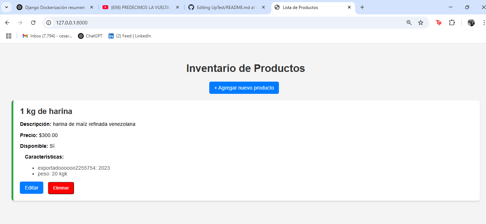

<h1 style="color:white">🛠️ Inventario Web con Django + PostgreSQL 🐘</h1>

¡Bienvenido a tu sistema de gestión de productos con características personalizadas!  
Con este proyecto podrás agregar productos, asignarles características dinámicamente y gestionar todo desde una interfaz simple, funcional y atractiva. 🚀

<div align="center">
  
</div>

---

🧰 Tecnologías Utilizadas

- 🐍 Python 3.10+  
- 🌐 Django 4.x  
- 🐘 PostgreSQL  
- 🎨 HTML + CSS (Bootstrap)  
- ⚙️ JavaScript (para características dinámicas)  
- 🐳 Docker (opcional, recomendado)  

---

📦 Instalación Paso a Paso

> Si quieres correr este proyecto en tu máquina local, sigue estas instrucciones. ¡Es muy fácil!
> ---
> 🖼️ Vista previa del proyecto
¡Así se ve tu app!

<div align="center">
  
</div>

<div align="center">
  
</div>

1. 🔁 Clona el repositorio


```bash
git clone https://github.com/developermaster22/inventario-django.git
cd inventario-django

2. 🐍 Crea un entorno virtual
python -m venv env
source env/bin/activate  # En Linux/Mac
env\Scripts\activate     # En Windows

3. 🧪 Instala las dependencias
pip install -r requirements.txt

4. 🐘 Configura tu base de datos PostgreSQL
Crea una base de datos en PostgreSQL y actualiza tu archivo .env (o settings.py) con estos datos:
DB_NAME=nombre_de_tu_db
DB_USER=usuario
DB_PASSWORD=contraseña
DB_HOST=localhost
DB_PORT=5432

5. 🔧 Realiza las migraciones
python manage.py makemigrations
python manage.py migrate

6. 👤 Crea un superusuario (opcional)
python manage.py createsuperuser

7. 🚀 Ejecuta el servidor
python manage.py runserver
Luego entra a 👉 http://127.0.0.1:8000

💡 Características
✅ Agregar productos
✅ Añadir múltiples características por producto
✅ Edición de productos y características
✅ Alerta animada al guardar cambios (¡desaparece en 4 segundos!)
✅ Interfaz responsive y funcional
✅ Soporte para PostgreSQL
✅ Listado de productos con botones y colores llamativos

🐳 Docker (opcional pero recomendado)
1. 🐳 Construye y levanta los contenedores</h3>
docker-compose up --build

2. 💾 Accede a la app
http://localhost:8000

🎯 Usa este comando si necesitas ejecutar migraciones dentro del contenedor:
docker-compose exec web python manage.py migrate

🙌 Contribuciones
¿Quieres mejorar esta app? ¡Eres más que bienvenido!
Haz un fork, crea tu rama y envía un PR 💪
git checkout -b nueva-funcionalidad
git commit -m "Agrego nueva funcionalidad"
git push origin nueva-funcionalidad
📬 Contacto
📧 cesarlinares1522@gmail.com
🐙 GitHub: @developermaster22


